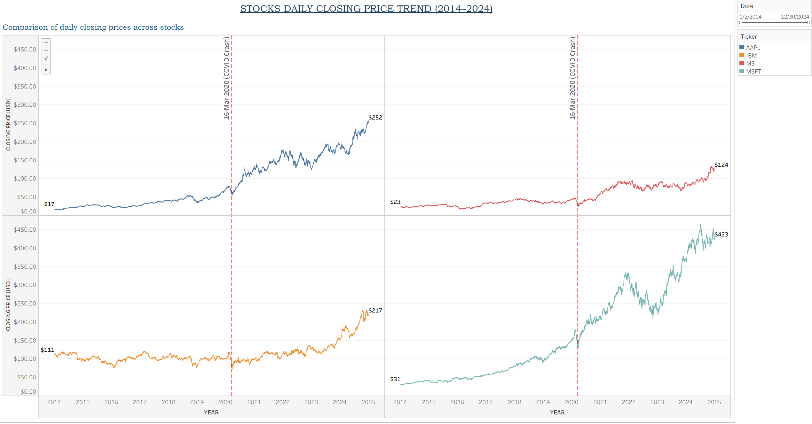
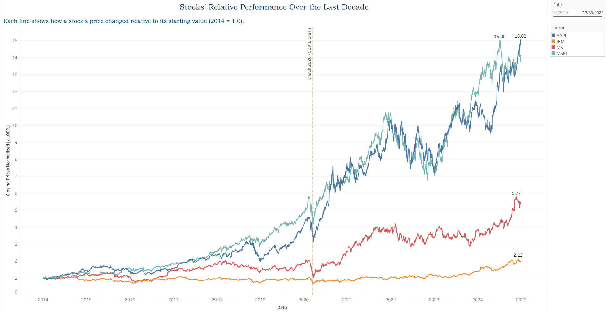
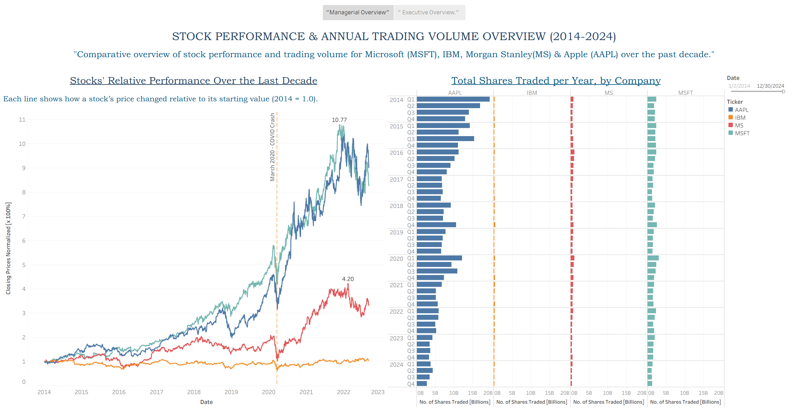

# Stock Data Management App & Data-to-Visualization Pipeline

[](https://www.python.org/)
[](https://www.sqlite.org/index.html)
[](https://github.com/TomSchimansky/CustomTkinter)
[](https://www.tableau.com/)
[](https://pandas.pydata.org/)

---

## Overview
This is an **end-to-end stock data management and visualization project**. It integrates:
- **Desktop App (CustomTkinter)** for CRUD operations
- **SQLite** database for local storage
- **Pandas & CSV export** for data manipulation
- **Tableau** for downstream visualization

The workflow automates fetching historical stock data from **Yahoo Finance** (MSFT, IBM, AAPL, MS) and creates a **data-to-visualization pipeline**.

---

## Features
- 🖥️ **Modern GUI** with CustomTkinter
- 🔄 **Full CRUD Operations** (Create, Read, Update, Delete)
- 📥 **Automated Data Fetch** from Yahoo Finance
- 🗄️ **SQLite database** with duplicate prevention
- 📤 **CSV Export** for Tableau or other analysis tools
- ⚡ **Classic & Modern GUI** support (`main_guiC.py` / `main_guiM.py`)
---

## Tech Stack
| Category         | Tools / Libraries |
|:-----------------|:------------------|
| Frontend GUI     | CustomTkinter     |
| Backend Database | SQLite3           |
| Data Fetching    | yfinance          |
| Data Handling    | Pandas            |
| Visualization    | Tableau           |
| Environment      | Python 3.11+      |

---

## ⚙️ Installation & Usage

1.  **Clone the repository**
    ```bash
    git clone https://github.com/A-purv-Ai/stock-data-pipeline.git
    cd stock-data-pipeline
    ```
2.  **Install dependencies**
    ```bash
    pip install customtkinter yfinance pandas
    ```
3.  **Run the modern GUI**
    ```bash
    python main_guiM.py
    ```
    *(Alternatively, run `python main_guiC.py` for the classic version.)*

4.  **Inspect the database**
    - Open `database/stocks.db` using a tool like **DB Browser for SQLite** to check data operations.
    - Verify that data insertion and other CRUD operations from the GUI are working correctly.

5.  **Export & Visualize**
    - Run the export script to generate a CSV file from the database.
      ```bash
      python export_csv.py
      ```
    - Import the resulting `database/stock_data_export.csv` file into **Tableau** to create dashboards.


## 📂 Project Structure
```
📦 stock-data-pipeline/
┣ 📁 scripts/
┃ ┣ 📜 main_guiM.py ─ Modern GUI (CustomTkinter)
┃ ┣ 📜 main_guiC.py ─ Classic GUI
┃ ┣ 📜 db_utils.py ─ Database utilities
┃ ┣ 📜 import_yahoo.py ─ Automated Yahoo Finance importer
┃ ┣ 📜 export_csv.py ─ CSV export script
┃ ┣ 📜 insert_window.py ─ GUI for adding data
┃ ┣ 📜 delete_window.py ─ GUI for deleting data
┃ ┣ 📜 select_window.py ─ GUI for selecting data
┃ ┗ 📜 update_window.py ─ GUI for updating data
┣ 📁 images/
┃ ┣ 🖼️ Executive_Overview_Story.png
┃ ┣ 🖼️ Stocks_Relative_Performance.png
┃ ┣ 🖼️ Stocks_Closing_Price_Trend.png
┃ ┗ 🖼️ Managerial_Overview_Dashboard.png
┣ 📁 database/
┃ ┣ 🗄️ stocks.db ─ SQLite database
┃ ┣ 📄 stock_data_export.csv ─ Exported CSV (analysis/Tableau)
┃ ┗ 🗄️ stocks DB Browser.sqpro ─ (Optional) DB Browser session
┣ 📜 README.md ─ Project documentation
┗ (other project files)
```
## 📜 Python Scripts

Below are the main Python scripts included in this project:

| 📜 Script              | Description                                             |
|------------------------|--------------------------------------------------------|
| `main_guiM.py`         | Modern GUI for stock data operations (CustomTkinter)   |
| `main_guiC.py`         | Classic-style GUI for stock management                 |
| `db_utils.py`          | Database utility functions (CRUD)                      |
| `import_yahoo.py`      | Importer for Yahoo Finance historical data             |
| `export_csv.py`        | Export stock data from SQLite DB to CSV                |
| `insert_window.py`     | GUI to insert new stock data                           |
| `delete_window.py`     | GUI to delete database records                         |
| `select_window.py`     | GUI to select/view records                             |
| `update_window.py`     | GUI to update database entries                         |


---

## 📂 Data Files

| 🗄️ File                              | Description                                 |
|--------------------------------------|---------------------------------------------|
| `database/stocks.db`                 | SQLite database of stock records            |
| `database/stock_data_export.csv`     | CSV export for analysis/Tableau             |
| `database/stocks DB Browser.sqpro`   | (Optional) DB Browser session file          |


---

## 📊 Data Visualizations

🖼️ **Stocks Daily Closing Price Trend**  
[](images/Stocks_Closing_Price_Trend.png)  
Daily closing price evolution for MSFT, IBM, MS, and AAPL, revealing volatility and movement.

🖼️ **Stocks' Relative Performance Over the Last Decade**  
[](images/Stocks_Relative_Performance.png)  
Line chart showing how each stock's price changed relative to its starting value (2014 = 1.0), highlighting company growth.

🖼️ **Managerial Overview Dashboard**  
[](images/Managerial_Overview_Dashboard.png)  
Normalized price trends and quarterly traded volume for the four major stocks—granular executive/managerial view.

🖼️ **Executive Overview Dashboard**  
[](images/Executive_Overview_Story.png)  
Combined stock performance and annual trading volume for MSFT, IBM, MS, and AAPL (normalized closing prices and yearly volume, 2014–2024).

---
## 🔁 Quick Reference Table

| Step        | Purpose                                | 📜 File / 🛠️ Tool           |
|-------------|----------------------------------------|------------------------------|
| 1           | Launch modern GUI                      | `scripts/main_guiM.py`       |
| 2           | Manage DB & CRUD ops                   | `scripts/db_utils.py`, `database/stocks.db`|
| 3           | Import Yahoo data                      | `scripts/import_yahoo.py`    |
| 4           | Export to CSV                          | `scripts/export_csv.py`      |
| 5           | Build Tableau dashboard                | Tableau Desktop              |


<!--
Alignment markers guide:
:----: → center align
:----  → left align
----:  → right align
-->
---

## Data-to-Visualization Flow
Yahoo Finance API → SQLite DB → CustomTkinter App (CRUD) → CSV Export → Tableau Dashboard


---

## 🔮 Future Enhancements
- Interactive charts inside the GUI
- Data filtering, sorting, and search functionality
- Multi-user support & authentication
- Executable build (`.exe` or `.app`) for easy distribution

---

## 👤 Author
**Apurva Upadhyay**
*Data Analytics | Data Science | AI Engineering*

[](https://linkedin.com/in/upadhyayapurva) [](mailto:apurvaupadhyayai@gmail.com)

📫 Feel free to connect and share feedback!

---

## 🏷️ Keywords

Financial Analytics · Python · Data Pipeline · CustomTkinter · SQLite · Pandas · Yahoo Finance · Tableau · Data Visualization · Stock Analysis · Desktop GUI · CRUD Application · End-to-End Solution · Dashboard 

